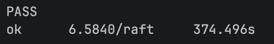

# lab2 开发日志
## 2026-6-16
pass!!!!



明天开始准备复盘！把这个README写好，重构就不用了， 本来就重构了一版，一共控制在了1000行以内自我感觉还是不错的

复盘内容准备如下：

- 详细的实现细节，踩坑记录，代码质量问题，等等
- 八股问题整理
## 2026-6-15
实现了全局日志

## 2026-6-14

本来想直接进行Lab2D实现的，但是觉得代码实在是太屎山了，于是重构了一版，相比上一版，感觉好看一下，也清晰一些

6月12 13 14 三天

## 2026-6-11

发现lab2D的实现，需要进行日志压缩，之前的lab2A和lab2B的实现没有考虑日志压缩，所以需要进行一些修改，来适应日志压缩的实现
就比如，lab2D的下标问题，我觉得之前的实现是基于日志不压缩的情况下的下标实现的


## 2026-6-10

lab2C较简单，并且把2B的内容给改了改。

## 2026-06-09

历时789三天，lab2B完成，依旧屎山这一块，依旧复盘等lab2全部完成再复盘这一块
## 2026-06-06

Lab2A 初步完成，使用
```bash
for i in {1..100}; do go test -run 2A || break; done
```
测试100次，全部通过

但是代码屎山，具体的实现细节和代码质量问题，以后再优化吧

具体的踩坑记录，后续再说吧

用时大概：八小时
## 2026-06-04

lab2 开始写代码

### 问题1:log[]如何实现
目前的想法是构建一个`logEntry`类，里面包含`term`和`command`两个属性


## 2026-06-01 -- 2026-06-03

阅读论文，了解Raft相关背景知识和算法细节 

个人认为像MIT助教说的一样，理解论文不能，但是细节实在是太多了
